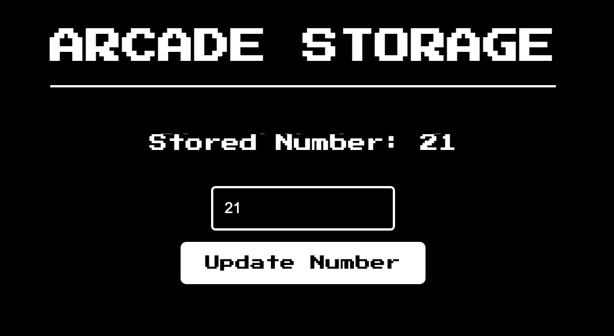

# 🕹️ Arcade Storage
> A simple Ethereum-based storage solution for arcade game scores. 🏆

## 🖼️ Project Screenshots

Here's a look at our Arcade Storage application in action:

This screenshot shows the main interface where users can store and retrieve their arcade game scores.

## 📝 Description
Arcade Storage is a decentralized application (dApp) that allows users to store and retrieve arcade game scores on the Ethereum blockchain. This project demonstrates the use of smart contracts and blockchain technology to create a transparent and tamper-proof system for game score management. Ideal for developers interested in blockchain applications or anyone passionate about preserving arcade game history in a modern way. 🎮

## 🛠 Technologies Used

This project utilizes several technologies and tools to function effectively as a decentralized application for storing arcade game scores on the Ethereum blockchain:

- **React.js**: A JavaScript library for building user interfaces, used here to create the frontend of the application.
- **Next.js**: A React framework that enables server-side rendering and generates static websites, enhancing the performance and SEO of the application.
- **Ethers.js**: A library aimed at making it easier to interact with the Ethereum blockchain and its ecosystem.
- **Solidity**: The programming language used to write smart contracts deployed on the Ethereum blockchain.
- **MetaMask**: A crypto wallet and gateway to blockchain apps, used for interacting with the Ethereum network in this project.
- **Node.js**: The JavaScript runtime used to run the development server and build scripts.
- **CSS Modules**: A CSS file in which all class names and animation names are scoped locally by default, used here for styling components in a modular fashion.

These technologies combine to provide a robust platform for arcade game enthusiasts to interact with blockchain technology.

## Installation ⬇️

### Follow these steps to get the project up and running 🏗️

1. Download or clone the project.
2. Install the dependencies by running `npm install`.
3. Start the local blockchain using Hardhat by running `npx hardhat node`.
4. Open new terminal and deploy the Bank contract `npx hardhat run --network localhost scripts/deploy.js`.
5. Start the development server by running `npm run dev`.

### Configure MetaMask to use the Hardhat node 🦊

1. Open the MetaMask extension in your browser.
2. Click on the account icon in the top right corner and select "Settings".
3. In the "Networks" tab, click on "Add Network".
4. Fill in the following details:
   - Network Name: hardhat-test-network
   - RPC URL: http://127.0.0.1:8545/
   - Chain ID: 31337
   - Currency Symbol: GO or ETH
5. Click on "Save" to add the Hardhat network to MetaMask.

### Add accounts using private keys by Hardhat for testing 🔑

1. In the MetaMask extension, click on the account icon in the top right corner.
2. Select "Import Account" or "Import Account using Private Key" (depending on your version of MetaMask).
3. In the "Private Key" field, enter one of the private keys provided by Hardhat.
   - To access the list of private keys, open the terminal where you started the Hardhat local network.
   - The private keys are displayed as part of the accounts generated by Hardhat.
4. Click on "Import" to import the account into MetaMask.
5. Repeat the above steps to add more accounts for testing purposes.

> If you need detailed instructions or visual guidance, you can refer to this step-by-step guide on [how to use MetaMask with a Hardhat node](https://support.chainstack.com/hc/en-us/articles/4408642503449-Using-MetaMask-with-a-Hardhat-node).

### 🚀Interacting with the Application

- **Connect MetaMask**
  - Open your browser and ensure MetaMask is logged in.
  - Connect MetaMask to the application by clicking the connect button on the homepage.

- **Store and Retrieve Scores**
  - Enter a score in the input field and click the "Update Score" button to store the score on the blockchain.
  - Click the "Fetch Score" button to retrieve and display the latest stored score.

Enjoy using Arcade Storage to manage your arcade game scores securely on the blockchain!

## 📄 Contract Details

- **Contract Address**
  - **Ethereum Network**: `0x5FbDB2315678afecb367f032d93F642f64180aa3`

- **Network**
  - **Deployed on**: Ropsten Test Network

- **ABI**
  - The ABI (Application Binary Interface) is crucial for interacting with the smart contract.
  - Located in the project under: `artifacts/contracts/Assessment.sol/SimpleStorage.json`.

- **Functions**
  - **set(uint256 score)**: Stores a new score on the blockchain. Requires a transaction and uses gas.
  - **get() returns (uint256)**: Retrieves the latest stored score from the blockchain. This is a view function and does not require gas.

## Configuration ⚙️

The `hardhat.config.js` file is used for configuring the Hardhat development environment. It specifies the Solidity version and required libraries to deploy contracts on the hardhat node.

## Scripts 📜

The `deploy.js` script, located in the `scripts` folder, is used to deploy the Bank contract. It uses Hardhat's `ethers` library to interact with the blockchain. This script is executed with the `npx hardhat run` command.
